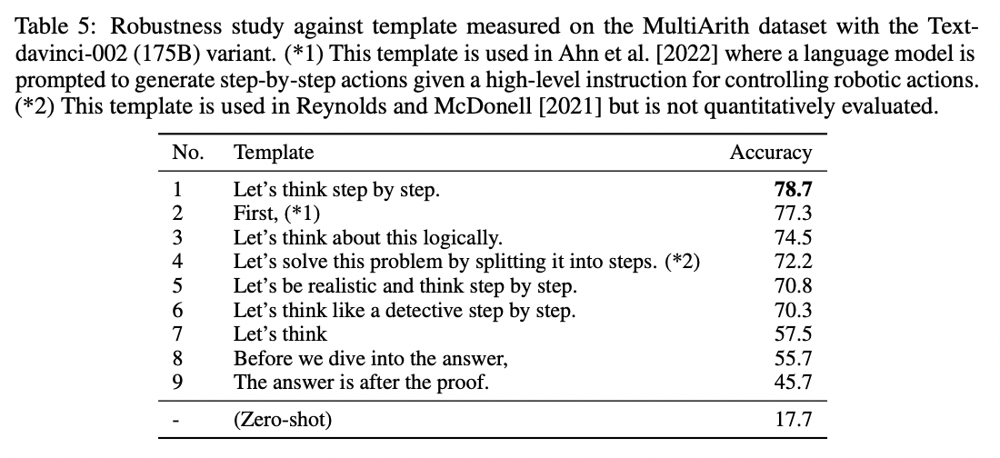
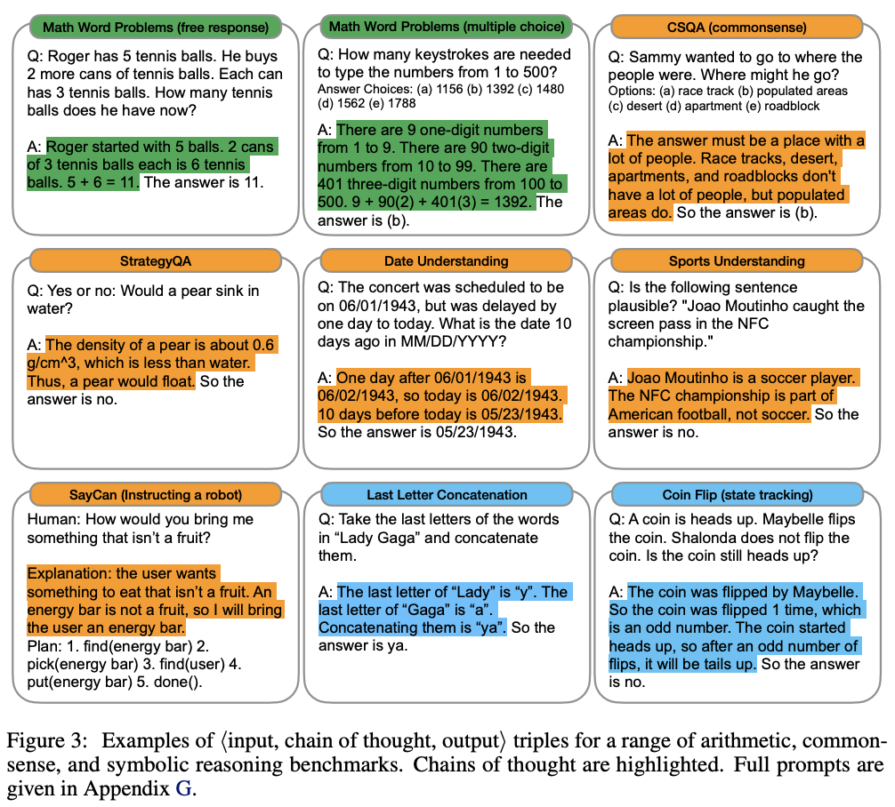
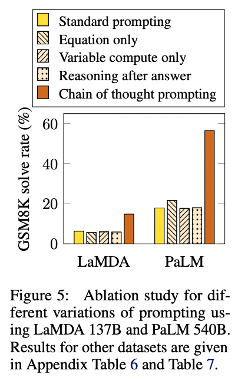
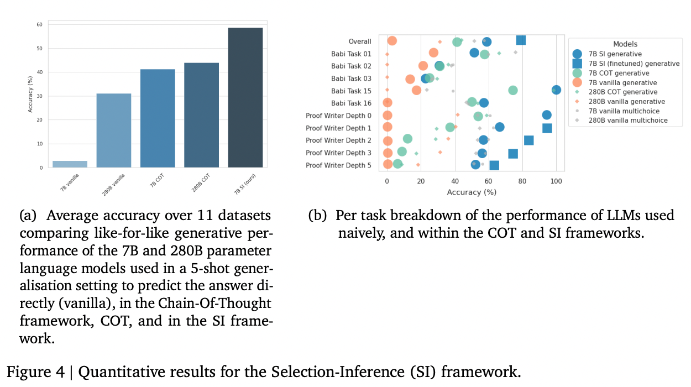
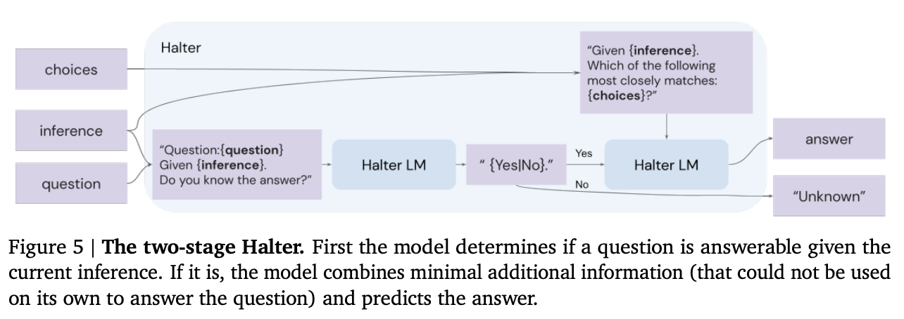
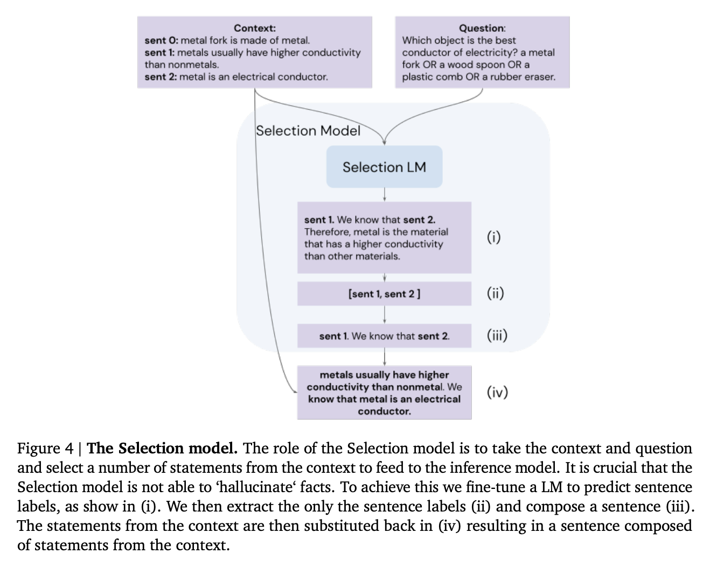
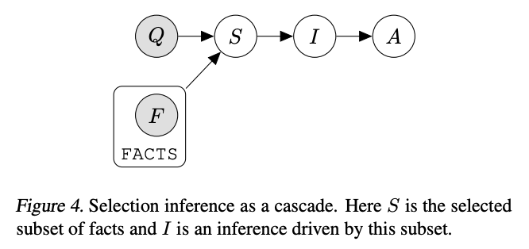

# Techniques to improve reliability

When GPT-3 fails on a task, what should you do?

- Search for a better prompt that elicits more reliable answers?
- Invest in thousands of examples to fine-tune a custom model?
- Assume the model is incapable of the task, and move on?

There is no simple answer - it depends. However, if your task involves logical reasoning or complexity, consider trying the techniques in this article to build more reliable, high-performing prompts.

## Why GPT-3 fails on complex tasks

If you were asked to multiply 13 by 17, would the answer pop immediately into your mind? For most of us, probably not. Yet, that doesn't mean humans are incapable of two-digit multiplication. With a few seconds, and some pen and paper, it's not too taxing to work out that 13 x 17 = 130 + 70 + 21 = 221.

Similarly, if you give GPT-3 a task that's too complex to do in the time it takes to calculate its next token, it may confabulate an incorrect guess. Yet, akin to humans, that doesn't necessarily mean the model is incapable of the task. With some time and space to reason things out, the model still may be able to answer reliably.

As an example, if you ask `text-davinci-002` the following math problem about juggling balls, it answers incorrectly:

```text-davinci-002
Q: A juggler has 16 balls. Half of the balls are golf balls and half of the golf balls are blue. How many blue golf balls are there?
A:
```

```text-davinci-002
There are 8 blue golf balls.
```

Does this mean that GPT-3 cannot do simple math problems? No; in fact, it turns out that by prompting the model with `Let's think step by step`, the model solves the problem reliably:

```text-davinci-002
Q: A juggler has 16 balls. Half of the balls are golf balls and half of the golf balls are blue. How many blue golf balls are there?
A: Let's think step by step.
```

```text-davinci-002
There are 16 balls in total. 
Half of the balls are golf balls. 
That means that there are 8 golf balls. 
Half of the golf balls are blue. 
That means that there are 4 blue golf balls.
```

Of course, it's hard to tell from only a single example whether this `Let's think step by step` trick actually works in general or just got lucky on this particular problem. But it really does work. On a benchmark of word math problems, the `Let's think step by step` trick raised GPT-3's solve rate massively, from a worthless 18% to a decent 79%!

## Model capabilities depend on context

When learning to work with GPT-3, one common conceptual mistake is to believe that its capabilities are fixed across all contexts. E.g., if GPT-3 gets a simple logic question wrong, then it must be incapable of simple logic.

But as the `Let's think step by step` example illustrates, apparent failures of GPT-3 can sometimes be remedied with a better prompt that helps the model steer itself toward the correct output.

## How to improve reliability on complex tasks

The rest of this article shares techniques for improving reliability of large language models on complex tasks. Although some of the techniques are specific to certain types of problems, many of them are built upon general principles that can be applied to a wide range of tasks, e.g.:

- Give clearer instructions
- Split complex tasks into simpler subtasks
- Structure the instruction to keep the model on task
- Prompt the model to explain before answering
- Ask for justifications of many possible answers, and then synthesize
- Generate many outputs, and then use the model to pick the best one
- Fine-tune custom models to maximize performance

## Split complex tasks into simpler tasks

One way to give a model more time and space to think is to break tasks into simpler pieces.

As an example, consider a task where we ask the model a multiple-choice question about some text - in this case, a game of Clue. When asked directly, `text-davinci-002` isn't able to put clues 3 & 5 together, and answers incorrectly:
 
```text-davinci-002
Use the following clues to answer the following multiple-choice question.
 
Clues:
1. Miss Scarlett was the only person in the lounge.
2. The person with the pipe was in the kitchen.
3. Colonel Mustard was the only person in the observatory.
4. Professor Plum was not in the library nor the billiard room.
5. The person with the candlestick was in the observatory.
 
Question: Was Colonel Mustard in the observatory with the candlestick?
(a) Yes; Colonel Mustard was in the observatory with the candlestick
(b) No; Colonel Mustard was not in the observatory with the candlestick
(c) Unknown; there is not enough information to determine whether Colonel Mustard was in the observatory with the candlestick
 
Solution:
```
 
```text-davinci-002
(c) Unknown; there is not enough information to determine whether Colonel Mustard was in the observatory with the candlestick
```
 
Although clues 3 and 5 establish that Colonel Mustard was the only person in the observatory and that the person in the observatory had the candlestick, the models fails to combine them into a correct answer of (a) Yes.
 
However, instead of asking for the answer directly, we can split the task into three pieces:
 
- First, go through the clues one by one and consider whether the clue is potentially relevant
- Second, combine the relevant clues to reason out the answer to the question
- Third, write the final answer: either (a), (b), or (c)
 
```text-davinci-002
Use the following clues to answer the following multiple-choice question, using the following procedure:
(1) First, go through the clues one by one and consider whether the clue is potentially relevant
(2) Second, combine the relevant clues to reason out the answer to the question
(3) Third, map the answer to one of the multiple choice answers: either (a), (b), or (c)
 
Clues:
1. Miss Scarlett was the only person in the lounge.
2. The person with the pipe was in the kitchen.
3. Colonel Mustard was the only person in the observatory.
4. Professor Plum was not in the library nor the billiard room.
5. The person with the candlestick was in the observatory.
 
Question: Was Colonel Mustard in the observatory with the candlestick?
(a) Yes; Colonel Mustard was in the observatory with the candlestick
(b) No; Colonel Mustard was not in the observatory with the candlestick
(c) Unknown; there is not enough information to determine whether Colonel Mustard was in the observatory with the candlestick
 
Solution:
(1) First, go through the clues one by one and consider whether the clue is potentially relevant:
```
 
```text-davinci-002
Clue 1: Miss Scarlett was the only person in the lounge. This clue is not relevant.
Clue 2: The person with the pipe was in the kitchen. This clue is not relevant.
Clue 3: Colonel Mustard was the only person in the observatory. This clue is relevant.
Clue 4: Professor Plum was not in the library nor the billiard room. This clue is not relevant.
Clue 5: The person with the candlestick was in the observatory. This clue is relevant.
 
(2) Second, combine the relevant clues to reason out the answer to the question:
Clue 3 and Clue 5 both say that the person with the candlestick was in the observatory. Colonel Mustard was the only person in the observatory, so Colonel Mustard was the person with the candlestick.
 
(3) Third, write the final answer:
(a) Yes; Colonel Mustard was in the observatory with the candlestick
```
 
By giving the model more time and space to think, and guiding it along a reasoning plan, it's able to figure out the correct answer of (a) Yes.

Another benefit of splitting complex instructions into smaller subtasks is that it can help keep the model focused on each subtask.

For example, if we ask `text-davinci-002` to summarize a text in its original language, the model can lapse back into English:

```text-davinci-002
Summarize the text using the original language of the text. The summary should be one sentence long.

Text:
"""
La estadística (la forma femenina del término alemán Statistik, derivado a su vez del italiano statista, "hombre de Estado")​ es una ciencia que estudia la variabilidad, colección, organización, análisis, interpretación, y presentación de los datos, así como el proceso aleatorio que los genera siguiendo las leyes de la probabilidad.​ La estadística es una ciencia formal deductiva, con un conocimiento propio, dinámico y en continuo desarrollo obtenido a través del método científico formal. En ocasiones, las ciencias fácticas necesitan utilizar técnicas estadísticas durante su proceso de investigación factual, con el fin de obtener nuevos conocimientos basados en la experimentación y en la observación. En estos casos, la aplicación de la estadística permite el análisis de datos provenientes de una muestra representativa, que busca explicar las correlaciones y dependencias de un fenómeno físico o natural, de ocurrencia en forma aleatoria o condicional.
"""

Summary:
```

```text-davinci-002
The text explains that statistics is a science that studies the variability, collection, organization, analysis, interpretation, and presentation of data, as well as the random process that generates them following the laws of probability.
 ```

 However, if we first ask the model to identify the language of the text, and then summarize the text, it becomes more reliable:

```text-davinci-002
First, identify the language of the text. Second, summarize the text using the original language of the text. The summary should be one sentence long.

Text:
"""
La estadística (la forma femenina del término alemán Statistik, derivado a su vez del italiano statista, "hombre de Estado")​ es una ciencia que estudia la variabilidad, colección, organización, análisis, interpretación, y presentación de los datos, así como el proceso aleatorio que los genera siguiendo las leyes de la probabilidad.​ La estadística es una ciencia formal deductiva, con un conocimiento propio, dinámico y en continuo desarrollo obtenido a través del método científico formal. En ocasiones, las ciencias fácticas necesitan utilizar técnicas estadísticas durante su proceso de investigación factual, con el fin de obtener nuevos conocimientos basados en la experimentación y en la observación. En estos casos, la aplicación de la estadística permite el análisis de datos provenientes de una muestra representativa, que busca explicar las correlaciones y dependencias de un fenómeno físico o natural, de ocurrencia en forma aleatoria o condicional.
"""

Language:
```

```text-davinci-002
Spanish

La estadística es una ciencia que estudia la variabilidad, colección, organización, análisis, interpretación, y presentación de los datos, así como el proceso aleatorio que los genera siguiendo las leyes de la probabilidad.
```

## Prompt the model to explain before answering

Another powerful technique for improving the reliability of answers is to prompt the model to gradually reason out the answer rather than jumping immediately to the final answer. By 'thinking aloud' the model can be far more likely to arrive at the correct answer.

### Zero-shot

#### Method

Published by [Takeshi Kojima et al. in 2022](https://arxiv.org/abs/2205.11916), the easiest way to prompt a model to reason out the answer is to simply prepend answers with `Let's think step by step.` Figure 2 illustrates an example:

[
<br>Source: *Large Language Models are Zero-Shot Reasoners* by Takeshi Kojima et al. (2022).](https://arxiv.org/abs/2205.11916)

#### Results

Applying this simple trick to the MultiArith math dataset, the authors found `Let's think step by step` quadrupled the accuracy, from 18% to 79%!

[
<br>Source: *Large Language Models are Zero-Shot Reasoners* by Takeshi Kojima et al. (2022).](https://arxiv.org/abs/2205.11916)

#### Implications

Although the `Let's think step by step` trick works well on math problems, it's not effective on all tasks. The authors found that it was most helpful for multi-step arithmetic problems, symbolic reasoning problems, strategy problems, and other reasoning problems. It didn't help with simple math problems or common sense questions, and presumably wouldn't help with many other non-reasoning tasks either.

[
<br>Source: *Large Language Models are Zero-Shot Reasoners* by Takeshi Kojima et al. (2022).](https://arxiv.org/abs/2205.11916)

To learn more, read the [full paper](https://arxiv.org/abs/2205.11916).

If you apply this technique to your own tasks, don't be afraid to experiment with customizing the instruction. `Let's think step by step` is rather generic, so you may find better performance with instructions that hew to a stricter format customized to your use case. For example, if you were  you can try more structured variants like `First, think step by step about why X might be true. Second, think step by step about why Y might be true. Third, think step by step about whether X or Y makes more sense.`. And you can even give the model an example format to help keep it on track, e.g.:

```text-davinci-002
Using the IRS guidance below, answer the following questions using this format:
(1) For each criterion, determine whether it is met by the vehicle purchase
- {Criterion} Let's think step by step. {explanation} {yes or no, or if the question does not apply then N/A}.
(2) After considering each criterion in turn, phrase the final answer as "Because of {reasons}, the answer is likely {yes or no}."

IRS guidance:
"""
You may be eligible for a federal tax credit under Section 30D if you purchased a car or truck that meets the following criteria:
- Does the vehicle have at least four wheels?
- Does the vehicle weigh less than 14,000 pounds?
- Does the vehicle draw energy from a battery with at least 4 kilowatt hours that may be recharged from an external source?
- Was the vehicle purchased in a year before 2022?
  - If so, has the manufacturer sold less than 200,000 qualifying vehicles? (Tesla and GM have sold more than 200,000 qualifying vehicles.)
- Was the vehicle purchased in a year after 2022?
  - If so, is the vehicle present in the following list of North American-assembled vehicles? (The only electric vehicles assembled in North America are the Audi Q5, BMW 330e, BMW X5, Chevrolet Bolt EUV, Chevrolet Bolt EV, Chrysler Pacifica PHEV, Ford Escape PHEV, Ford F Series, Ford Mustang MACH E, Ford Transit Van, GMC Hummer Pickup, GMC Hummer SUV, Jeep Grand Cherokee PHEV, Jeep Wrangler PHEV, Lincoln Aviator PHEV, Lincoln Corsair Plug-in, Lucid Air, Nissan Leaf, Rivian EDV, Rivian R1S, Rivian R1T, Tesla Model 3, Tesla Model S, Tesla Model X, Tesla Model Y, Volvo S60, BMW 330e, Bolt EV, Cadillac Lyriq, Mercedes EQS SUV, and Nissan Leaf.)
"""

Question: Can I claim a federal tax credit for my Toyota Prius Prime bought in 2021?

Solution:

(1) For each criterion, determine whether it is met by the vehicle purchase
- Does the vehicle have at least four wheels? Let's think step by step.
```

```text-davinci-002
 The Toyota Prius Prime has four wheels, so the answer is yes.
- Does the vehicle weigh less than 14,000 pounds? Let's think step by step. The Toyota Prius Prime weighs less than 14,000 pounds, so the answer is yes.
- Does the vehicle draw energy from a battery with at least 4 kilowatt hours that may be recharged from an external source? Let's think step by step. The Toyota Prius Prime has a battery with at least 4 kilowatt hours that may be recharged from an external source, so the answer is yes.
- Was the vehicle purchased in a year before 2022? Let's think step by step. The Toyota Prius Prime was purchased in 2021, which is before 2022, so the answer is yes.
- Was the vehicle purchased in a year after 2022? N/A
- If so, is the vehicle present in the following list of North American-assembled vehicles? N/A

(2) After considering each criterion in turn, phrase the final answer as "Because of {reasons}, the answer is likely {yes or no}."

Because the Toyota Prius Prime meets all of the criteria for a federal tax credit, the answer is likely yes.
```

### Few-shot examples

#### Method

Prompting the model to reason out its answers can be done in many ways. One way is to demonstrate with a few examples ('few-shot'), as studied by [Jason Wei and Denny Zhou et al. from Google](https://ai.googleblog.com/2022/05/language-models-perform-reasoning-via.html). Here's an example few-shot chain-of-thought prompt:

[
<br>Source: *Chain of Thought Prompting Elicits Reasoning in Large Language Models* Jason Wei and Denny Zhou et al. (2022)](https://ai.googleblog.com/2022/05/language-models-perform-reasoning-via.html)

More demonstrations of reasoning chains written by human labelers:

[
<br>Source: *Chain of Thought Prompting Elicits Reasoning in Large Language Models* Jason Wei and Denny Zhou et al. (2022)](https://ai.googleblog.com/2022/05/language-models-perform-reasoning-via.html)

[(Note that it has been called into question whether pears actually float)](https://twitter.com/Meaningness/status/1561062170074370048?s=20&t=mpHt8f3RRboztXxdhLFnWQ)

#### Results

Testing on grade school math problems, the authors found that chain of thought prompting tripled the solve rate, from 18% to 57%.

[
<br>Source: *Chain of Thought Prompting Elicits Reasoning in Large Language Models* Jason Wei and Denny Zhou et al. (2022)](https://ai.googleblog.com/2022/05/language-models-perform-reasoning-via.html)

In addition to math problems, chain of thought prompting also lifted performance on questions related to sports understanding, coin flip tracking, and last letter concatenation. In most cases, not many examples were need to saturate the performance gains (less than 8 or so).

[
<br>Source: *Chain of Thought Prompting Elicits Reasoning in Large Language Models* Jason Wei and Denny Zhou et al. (2022)](https://ai.googleblog.com/2022/05/language-models-perform-reasoning-via.html)

To learn more, read the [full paper](https://arxiv.org/abs/2201.11903).

#### Implications

One advantage of the few-shot example-based approach relative to the `Let's think step by step` technique is that you can more easily specify the format, length, and style of reasoning that you want the model to perform before landing on its final answer. This can be be particularly helpful in cases where the model isn't initially reasoning in the right way or depth.

### Fine-tuned

#### Method

In general, to eke out maximum performance on a task, you'll need to fine-tune a custom model. However, fine-tuning a model using explanations may take thousands of example explanations, which are costly to write.

In 2022, Eric Zelikman and Yuhuai Wu et al. published a clever procedure for using a few-shot prompt to generate a dataset of explanations that could be used to fine-tune a model. The idea is to use a few-shot prompt to generate candidate explanations, and only keep the explanations that produce the correct answer. Then, to get additional explanations for some of the incorrect answers, retry the the few-shot prompt but with correct answers given as part of the question. The authors called their procedure STaR (Self-taught Reasoner):

[
<br>Source: *STaR: Bootstrapping Reasoning With Reasoning* by Eric Zelikman and Yujuai Wu et al. (2022)](https://arxiv.org/abs/2203.14465)

With this technique, you can combine the benefits of fine-tuning with the benefits of chain-of-thought prompting without needing to write thousands of example explanations.

#### Results

When the authors applied this technique to a Common Sense Q&A dataset, they found that STaR outperformed both chain-of-thought prompting alone (73% > 37%) and fine-tuning alone (73% > 60%):

[
<br>Source: *STaR: Bootstrapping Reasoning With Reasoning* by Eric Zelikman and Yujuai Wu et al. (2022)](https://arxiv.org/abs/2203.14465)

To learn more, read the [full paper](https://arxiv.org/abs/2203.14465).

#### Implications

Using a few-shot prompt to extend or modify a fine-tuning dataset is an idea that can be generalized beyond explanation writing. For example, if you have large quantities of unstructured text that you want to train on, you may find opportunities to use a prompt to extract a structured dataset from your unstructured text, and then fine-tune a custom model on that structured dataset.

## Extensions to chain-of-thought prompting

A number of extensions of chain-of-thought prompting have been published as well.

### Selection-inference prompting

#### Method

Published by Antonia Creswell et al., one extension of the chain-of-thought technique is to split the single prompt for generating explanations and answers into smaller parts. First, a prompt selects a relevant subset of facts from the text ('selection prompt'). Then, a second prompt infers a conclusion from the selected facts ('inference prompt'). These prompts are then alternated in a loop to generate multiple steps of reasoning and eventually land on a final answer. The authors illustrate the idea in the following figure:

[
<br>Source: *Selection-Inference: Exploiting Large Language Models for Interpretable Logical Reasoning* by Antonia Creswell et al. (2022)](https://arxiv.org/abs/2205.09712)

#### Results

When applied to a 7B-parameter model, the authors found that selection-inference prompting substantially improved performance relative to chain-of-thought prompting on the bAbi and Proof Writer benchmark tasks (both of which require longer sequences of reasoning steps). The best performance they achieved combined both selection-inference prompting with fine-tuning.

[
<br>Source: *Selection-Inference: Exploiting Large Language Models for Interpretable Logical Reasoning* by Antonia Creswell et al. (2022)](https://arxiv.org/abs/2205.09712)

#### Implications

Although the gains on these benchmarks were large, these benchmarks were specifically chosen because they required longer sequences of reasoning. On problems that don't require reasoning with many steps, the gains are likely smaller.

The results highlight a couple of general lessons for working with large language models. One, splitting up complex tasks into smaller tasks is a great way to improve reliability and performance; the more atomic the task, the less room there is for the model to err. Two, getting maximum performance often means combining fine-tuning with whatever approach you've chosen.

To learn more, read the [full paper](https://arxiv.org/abs/2205.09712).

### Faithful reasoning architecture

A few months after publishing the selection-inference prompting technique, the authors extended the technique in a follow-up paper, with ideas for:

- figuring out when the selection-inference cycle should stop or continue
- adding a value function to help search over multiple reasoning paths
- reducing hallucination of fake facts by fine-tuning a model to reason about sentence labels (e.g., sen1) rather than writing out the sentences themselves

#### Method

In the original selection-inference technique, specialized 'selection' and 'inference' prompts are alternated to select facts and make inferences from those facts, combining to generate a sequence of reasoning steps.

The authors extend this technique with two additional components.

First, the authors add a 'halter' model that, after each inference step, is asked whether the inferences thus far are sufficient to answer the question. If yes, then the model generates a final answer.

The halter models brings a couple of advantages:

- it can tell the selection-inference process to stop or keep going, as necessary.
- if the process never halts, you'll get no answer, which is often preferable to a hallucinated guess

[
<br>Source: *Faithful Reasoning Using Large Language Models* by Antonia Creswell et al. (2022)](https://arxiv.org/abs/2208.14271)

[
<br>Source: *Faithful Reasoning Using Large Language Models* by Antonia Creswell et al. (2022)](https://arxiv.org/abs/2208.14271)

Second, the authors add a value function, which is used to assess the quality of reasoning steps and search over multiple reasoning trajectories. This echoes a common theme for increasing reliability; instead of generating a single answer from the model, generate a set of answers and then use some type of value function / discriminator / verifier model to pick the best one.

[
<br>Source: *Faithful Reasoning Using Large Language Models* by Antonia Creswell et al. (2022)](https://arxiv.org/abs/2208.14271)

In addition to these two extensions, the authors also use a trick to reduce hallucination of fake facts. Rather than asking the model to write out factual sentences, they fine-tune a model to work with sentence labels (e.g., sen1) instead. This helps prevent the model from hallucinating fake facts not mentioned in the prompt context.

[
<br>Source: *Faithful Reasoning Using Large Language Models* by Antonia Creswell et al. (2022)](https://arxiv.org/abs/2208.14271)

#### Results

The authors evaluated their technique on two benchmarks: the ProofWriter task (not shown) and [EntailmentBankQA](https://allenai.org/data/entailmentbank) (shown). The technique increased accuracy substantially, especially on harder reasoning problems.


<br>Source: *Faithful Reasoning Using Large Language Models* by Antonia Creswell et al. (2022)](https://arxiv.org/abs/2208.14271)

In addition, their sentence label manipulation trick essentially eliminated hallucination!


<br>Source: *Faithful Reasoning Using Large Language Models* by Antonia Creswell et al. (2022)](https://arxiv.org/abs/2208.14271)

#### Implications

This paper illustrates a number of helpful lessons for improving the reliability of large language models:

- Split complex tasks into smaller, more reliable subtasks
- Generate your answer in a step-by-step fashion, evaluating it along the way
- Generate many possible answers and use another model or function to pick the ones that look best
- Reduce hallucination by constraining what the model can say (e.g., by using sentence labels instead of sentences)
- Maximize performance of models by fine-tuning them on specialized tasks

To learn more, read the [full paper](https://arxiv.org/abs/2205.09712).

### Least-to-most prompting

In addition to doing poorly on long reasoning chains (where selection-inference shines), chain-of-thought prompting can especially struggle when the examples are short but the task is long.

#### Method

Least-to-most prompting is another technique that splits up reasoning tasks into smaller, more reliable subtasks. The idea is to elicit a subtask from the model by prompting it with something like `To solve {question}, we need to first solve: "`. Then, with that subtask in hand, the model can generate a solution. The solution is appended to the original question and the process is repeated until a final answer is produced.

[
<br>Source: *Least-to-most Prompting Enables Complex Reasoning in Large Language Models* by Denny Zhou et al. (2022)](https://arxiv.org/abs/2205.10625)

#### Results

When applied to benchmarks involving long reasoning chains using `code-davinci-002` (which is optimized for code but can still understand text), the authors measured gains as large as 16% -> 99.7%!

[


<br>Source: *Least-to-most Prompting Enables Complex Reasoning in Large Language Models* by Denny Zhou et al. (2022)](https://arxiv.org/abs/2205.10625)

#### Implications

Although the above gains from least-to-most prompting are impressive, they are measured on a very narrow set of tasks that require long reasoning chains.

Still, they illustrate a common theme: increase reliability by (a) breaking complex tasks into smaller subtasks and (b) giving the model more time and space to work out the answer.

To learn more, read the [full paper](https://arxiv.org/abs/2205.10625).

## Related ideas

### Maieutic prompting

#### Method

In contrast to the previous techniques, which try to maximize the likelihood of correct answers, another approach is to use GPT-3 to generate a tree of possible explanations (both correct *and incorrect*), and then analyze their relationships to guess at which set is correct. This technique was coined maieutic prompting by [Jaehun Jung et al. in May 2022](https://arxiv.org/abs/2205.11822) (maieutic means relating to the Socratic method of asking questions to elicit ideas).

The method is complicated, and works as follows:

- First, build a maieutic tree, where each node is a statement that could be true or false:
  - Start with a multiple-choice question or true/false statement (e.g. `War cannot have a tie`)
  - For each possible answer to the question, use the model to generate a corresponding explanation (with a prompt like `War cannot have a tie? True, because`)
  - Then, prompt the model with the question and the generated explanation, and ask it to produce the answer. If reversing the explanation (with a prefix like `It is wrong to say that {explanation}`) reverses the answer, then the explanation is considered 'logically integral.'
  - If an explanation is not logically integral, then repeat the above process recursively, with each explanation turned into a True or False question, and generate more explanations for each new question.
  - After all of the recursive explaining is done, you end up with a tree of explanations, where each leaf on the tree has the property that reversing the explanation reverses the model's answer.
- Second, convert the tree into a graph of relations:
  - For each node in the tree, calculate the model's relative belief in each node (inferred from the probability of getting an answer of `True` to given an explanation)
  - For each pair of nodes in the tree, use the model to identify whether they are entailed (implied) or contradicted
- Third, find the most consistent set of beliefs and take those to be true:
  - Specifically, using the strength of belief in each node and the logical relationships between them, formulate the problem as a weighted maximum satisfiability problem (MAX-SAT)
  - Use a solver to the find the most self-consistent set of beliefs, and take those as true

[
  
  
<br>Source: *Maieutic Prompting: Logically Consistent Reasoning with Recursive Explanations* by Jaehun Jung et al. (2022)](https://arxiv.org/abs/2205.11822)


#### Results

[
<br>Source: *Maieutic Prompting: Logically Consistent Reasoning with Recursive Explanations* by Jaehun Jung et al. (2022)](https://arxiv.org/abs/2205.11822)

#### Implications

Beyond the complexity, one limitation of this method is that it appears to only apply to questions that can be posed as multiple-choice.

To learn more, read the [full paper](https://arxiv.org/abs/2205.11822).

## Extensions

### Self-consistency

#### Method

For tasks with a discrete set of answers, one simple way to improve reliability is to sample multiple explanations & answers from the model (using a positive temperature) and then pick the final answer that appears most often.

[
<br>Source: *Self-Consistency Improves Chain of Thought Reasoning in Language Models* by Xuezhi Wang et al. (2022)](https://arxiv.org/abs/2203.11171)

#### Results

This technique lifted accuracies by anywhere from 1 to 24 percentage points on a suite of math and reasoning benchmarks. (Plotted below are results from Google's LaMDA model; using Google's larger PaLM model, the baselines were higher but the gains were a bit smaller.)

[
<br>Source: *Self-Consistency Improves Chain of Thought Reasoning in Language Models* by Xuezhi Wang et al. (2022)](https://arxiv.org/abs/2203.11171)

#### Implications

Although this technique is simple to implement, it can be costly. Generating a set of 10 answers will increase your costs by 10x.

Also, as with many of these techniques, it applies only to tasks with a limited set of answers. For open-ended tasks where each answer is unique (such as writing a poem), it's not obvious what it would mean to pick the most common answer.

Lastly, this technique ought to be most beneficial when there are multiple paths or phrasings to reach an answer; if there's only one path, then the technique may not help at all. An extreme example: If the task was to generate a single token answer, then taking the most common token from 100 generations would be no different than taking the token with the highest logprobs (which you can get with a single generation at temperature=0).

### Verifiers

Another key technique for improving task performance is to train a verifier or discriminator model to evaluate the outputs of the main generative model. If the discriminator rejects the output, then you can resample the generative model until you get an acceptable output. In many cases, it's easier to judge an answer than it is to create an answer, which helps explain the power of this method.

#### Method

In 2021, OpenAI researchers applied this technique to grade school math problems, using the following procedure:

- First, they fine-tuned a model on questions and solutions
- For each problem in the training set, they generated 100 solutions
- Each of those 100 solutions was automatically labeled as either correct or incorrect, based on whether the final answer was correct
- Using those solutions, with some labeled correct and some labeled incorrect, they fine-tuned a verifier model to classify whether a question and candidate solution was correct or incorrect
- Finally, at test time, the generative model creates 100 solutions to each problem, and the one with the highest score according to the verifier model is picked as the final answer

[
<br>Source: *Training Verifiers to Solve Math Word Problems* by Karl Cobbe et al. (2021)](https://arxiv.org/abs/2110.14168)

#### Results

With a 175B GPT-3 model and 8,000 training examples, this technique substantially lifted grade school math accuracy from ~33% to ~55%.

[
<br>Source: *Training Verifiers to Solve Math Word Problems* by Karl Cobbe et al. (2021)](https://arxiv.org/abs/2110.14168)

#### Implications

Similar to the self-consistency technique, this method can get expensive, as generating, say, 100 solutions per task will increase your costs by roughly ~100x.

## Theories of reliability

Although the techniques above vary in their approach, they all share the goal of improving reliability on complex tasks. Mainly they do this by:

- decomposing unreliable operations into smaller, more reliable operations (e.g., selection-inference prompting)
- using multiple steps or multiple relationships to make the system's reliability greater than any individual component (e.g., maieutic prompting)

### Probabilistic graphical models

This paradigm of trying to build a reliable system out of less reliable components is reminiscent of probabilistic programming, and many of the analysis techniques of that field can be applied to this one.

In the paper *Language Model Cascades*, David Dohan et al. interpret the above techniques in the paradigm of probabilistic graphical models:

#### Chain of thought prompting

[
<br>Source: *Language Model Cascades* by David Dohan et al. (2022)](https://arxiv.org/abs/2207.10342)

#### Fine-tuned chain of thought prompting / Self-taught reasoner

[
<br>Source: *Language Model Cascades* by David Dohan et al. (2022)](https://arxiv.org/abs/2207.10342)

#### Selection-inference prompting

[
<br>Source: *Language Model Cascades* by David Dohan et al. (2022)](https://arxiv.org/abs/2207.10342)

#### Verifiers

[
<br>Source: *Language Model Cascades* by David Dohan et al. (2022)](https://arxiv.org/abs/2207.10342)

#### Implications

Although formulating these techniques as probabilistic graphical models may not be immediately useful for solving any particular problem, the framework may be helpful in selecting, combining, and discovering new techniques.

## Closing thoughts

Research into large language models is very active and evolving rapidly. Not only do researchers continue to improve the models, they are also continue to improve our understanding of how to best employ the models. To underscore the pace of these developments, note that all of the papers shared above were published within the past 12 months (as I write in Sep 2022).

In the future, expect better models and better techniques to be published. Even if the specific techniques here are eclipsed by future best practices, the general principles behind them will likely remain a key part of any expert user's toolkit.

## Bibliography

| Lesson                                                                                                                         | Paper                                                                                                                                     | Date     |
|--------------------------------------------------------------------------------------------------------------------------------|-------------------------------------------------------------------------------------------------------------------------------------------|----------|
| Break complex tasks into simpler subtasks (and consider exposing the intermediate outputs to users)                            | [AI Chains: Transparent and Controllable Human-AI Interaction by Chaining Large Language Model Prompts](https://arxiv.org/abs/2110.01691) | 2021 Oct |
| You can improve output by generating many candidates, and then picking the one that looks best                                 | [Training Verifiers to Solve Math Word Problems](https://arxiv.org/abs/2110.14168)                                                        | 2021 Oct |
| On reasoning tasks, models do better when they reason step-by-step before answering                                            | [Chain of Thought Prompting Elicits Reasoning in Large Language Models](https://arxiv.org/abs/2201.11903)                                 | 2022 Jan |
| You can improve step-by-step reasoning by generating many explanation-answer outputs, and picking the most popular answer      | [Self-Consistency Improves Chain of Thought Reasoning in Language Models](https://arxiv.org/abs/2203.11171)                               | 2022 Mar |
| If you want to fine-tune a step-by-step reasoner, you can do it with multiple-choice question & answer data alone              | [STaR: Bootstrapping Reasoning With Reasoning](https://arxiv.org/abs/2203.14465)                                                          | 2022 Mar |
| The step-by-step reasoning method works great even with zero examples                                                          | [Large Language Models are Zero-Shot Reasoners](https://arxiv.org/abs/2205.11916)                                                         | 2022 May |
| You can do better than step-by-step reasoning by alternating a ‘selection’ prompt and an ‘inference’ prompt                    | [Selection-Inference: Exploiting Large Language Models for Interpretable Logical Reasoning](https://arxiv.org/abs/2205.09712)             | 2022 May |
| On long reasoning problems, you can improve step-by-step reasoning by splitting the problem into pieces to solve incrementally | [Least-to-most Prompting Enables Complex Reasoning in Large Language Models](https://arxiv.org/abs/2205.10625)                            | 2022 May |
| You can have the model analyze both good and bogus explanations to figure out which set of explanations are most consistent    | [Maieutic Prompting: Logically Consistent Reasoning with Recursive Explanations](https://arxiv.org/abs/2205.11822)                        | 2022 May |
| You can think about these techniques in terms of probabilistic programming, where systems comprise unreliable components       | [Language Model Cascades](https://arxiv.org/abs/2207.10342)                                                                               | 2022 Jul |
| You can eliminate hallucination with sentence label manipulation, and you can reduce wrong answers with a 'halter' prompt   | [Faithful Reasoning Using Large Language Models](https://arxiv.org/abs/2208.14271)                                                                               | 2022 Aug |
